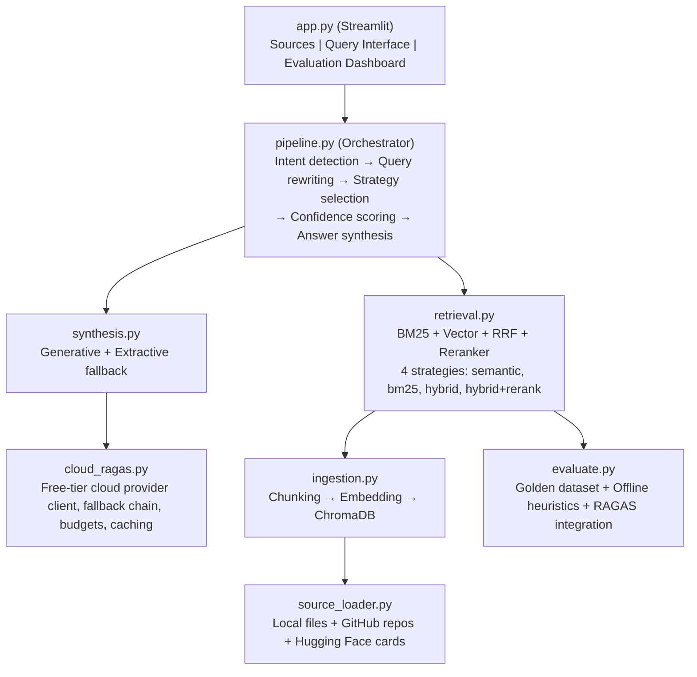

# Advanced-RAG

Advanced-RAG is a Retrieval-Augmented Generation workspace for local and public technical sources. It prepares source material, builds a local retrieval index, answers questions with hybrid retrieval, and evaluates retrieval quality with offline heuristics or optional RAGAS-backed cloud evaluation.

      

Core stack: Python 3.11, Streamlit, LlamaIndex, ChromaDB, rank-bm25, sentence-transformers, and RAGAS.

The project is offline-first by default. External fetches, model downloads, and cloud-dependent paths are gated explicitly.

## Supported Sources

The product currently supports three source types:

- **Local paths** — local directories or supported files from the device filesystem
- **GitHub repositories** — public repository URLs from `github.com`
- **Hugging Face model or dataset cards** — `hf:owner/model` shorthand or `https://huggingface.co/...` URLs

Notes:

- Local and GitHub sources ingest supported repository files into `data/raw/`
- Hugging Face sources ingest the source card `README.md` for the selected model or dataset

## System Architecture



Core modules:

- `source_loader.py` — prepares local, GitHub, and Hugging Face sources into `data/raw/`
- `ingestion.py` — chunks source files, computes embeddings, and persists the vector index
- `retrieval.py` — implements lexical, semantic, hybrid, and reranked retrieval strategies
- `pipeline.py` — coordinates query analysis, retrieval, synthesis, and fallback behavior
- `synthesis.py` — handles generative and extractive answer synthesis
- `evaluate.py` — generates golden datasets and runs evaluation
- `cloud_ragas.py` — integrates optional free-tier cloud providers for synthesis and RAGAS evaluation
- `app.py` — Streamlit interface for source preparation, querying, and evaluation

## Runtime Behavior

### Source Preparation

Prepared sources are stored under `data/raw/`.

- Local and GitHub sources are filtered by supported extensions such as `.py`, `.md`, `.ts`, `.js`, `.json`, `.yaml`, `.toml`, `.txt`, and `.rst`
- Symlinks are rejected
- Ignored directories such as `node_modules`, `.git`, and `__pycache__` are skipped
- Hugging Face sources fetch the card `README.md` through the raw `/resolve/main/README.md` endpoint

### Indexing

Source files are chunked with LlamaIndex `SentenceSplitter` using a 512-token chunk size and 50-token overlap. Embeddings are generated locally with `BAAI/bge-small-en-v1.5` and stored in ChromaDB.

If no vector index exists, the product falls back to lexical-only retrieval.

### Querying

The query flow supports four retrieval strategies:

| Strategy | Description |
|---|---|
| `semantic_only` | Vector similarity retrieval |
| `bm25_only` | BM25 lexical retrieval |
| `hybrid_no_rerank` | Vector + BM25 with Reciprocal Rank Fusion |
| `hybrid_rerank` | Hybrid retrieval with cross-encoder reranking |

Answer synthesis has two modes:

- **Generative** — uses a configured free-tier provider when query-time cloud chat is allowed
- **Extractive fallback** — uses retrieved context directly when cloud chat is disabled, unavailable, or fails

### Evaluation

Evaluation generates a golden dataset from the indexed source and scores all retrieval strategies across:

- Faithfulness
- Answer relevancy
- Context recall
- Context precision

Two evaluation modes exist:

- **Offline heuristic evaluation** — local only
- **RAGAS-backed evaluation** — optional cloud-backed evaluation when explicitly enabled

## Configuration

Runtime defaults come from `.env`. The Streamlit UI can override selected operational gates for the current session only.

### Provider Configuration

| Variable | What it does |
|---|---|
| `GEMINI_API_KEY` | Enables Gemini as a provider for supported cloud flows |
| `GEMINI_MODEL` | Selects the Gemini model used by this project |
| `GROQ_API_KEY` | Enables Groq as a fallback provider |
| `GROQ_MODEL` | Selects the Groq model used by this project |
| `GITHUB_MODELS_TOKEN` | Enables GitHub Models as a fallback provider |
| `GITHUB_MODELS_MODEL` | Selects the GitHub Models model identifier |

### Source Preparation Gates

| Variable | Default | What it does |
|---|---:|---|
| `ALLOW_HF_FETCH` | `0` | Allows fetching Hugging Face model or dataset card `README.md` files |
| `ALLOW_GITHUB_FETCH` | `0` | Allows downloading public GitHub repositories for preparation |
| `ALLOW_DOCS_DOWNLOAD` | `0` | Allows the Python-docs bootstrap fallback when `data/raw/` is empty |

### Local Indexing and Model Gates

| Variable | Default | What it does |
|---|---:|---|
| `ALLOW_INDEX_BUILD` | `1` | Allows the application to build a local ChromaDB index |
| `ALLOW_MODEL_DOWNLOADS` | `0` | Allows downloading optional local models such as the reranker |

### Query-Time Cloud Chat

| Variable | Default | What it does |
|---|---:|---|
| `ALLOW_CLOUD_CHAT` | `1` | Allows query-time generative synthesis; set `ALLOW_CLOUD_CHAT=0` to force extractive fallback |
| `MAX_CLOUD_CHAT_CALLS` | `1` | Limits how many cloud chat calls the query path may make |
| `CLOUD_CHAT_PROVIDER_TIMEOUT_SECONDS` | `10` | Per-provider timeout for a single cloud chat attempt |
| `CLOUD_CHAT_TOTAL_TIMEOUT_SECONDS` | `30` | Total timeout budget across the cloud chat flow |

### Evaluation and RAGAS Gates

These variables affect evaluation only. They do not enable query-time cloud chat by themselves.

| Variable | Default | What it does |
|---|---:|---|
| `USE_CLOUD_FREE_TIER_RAGAS` | `0` | Enables cloud-backed RAGAS evaluation paths |
| `ALLOW_CLOUD_FREE_TIER` | `0` | Allows cloud-backed free-tier evaluation flows |
| `MAX_CLOUD_CALLS` | `120` | Sets the maximum evaluation API call budget |
| `CLOUD_RAGAS_STRICT` | `0` | When `1`, evaluation fails hard instead of falling back to offline heuristics |
| `CLOUD_PROVIDER_ORDER` | `gemini,github,groq` | Configures the allowlisted provider fallback order |

### Session Overrides in the UI

The Streamlit UI exposes session-scoped toggles for:

- `ALLOW_HF_FETCH`
- `ALLOW_GITHUB_FETCH`
- `ALLOW_DOCS_DOWNLOAD`
- `ALLOW_INDEX_BUILD`
- `ALLOW_MODEL_DOWNLOADS`
- `ALLOW_CLOUD_CHAT`
- `USE_CLOUD_FREE_TIER_RAGAS`
- `ALLOW_CLOUD_FREE_TIER`

These toggles use `.env` as the default source of truth, apply only to the current Streamlit session, and do not rewrite `.env`.

Advanced limits such as `MAX_CLOUD_CALLS`, `CLOUD_CHAT_TOTAL_TIMEOUT_SECONDS`, and `CLOUD_RAGAS_STRICT` remain environment-only.

## Usage

### Quick Start

```bash
git clone https://github.com/Shizu0n/Advanced-RAG && cd Advanced-RAG
pip install -r requirements.txt
cp .env.example .env
streamlit run app.py
```

The app opens at `http://localhost:8501` with three tabs:

- **Sources** — prepare local paths, GitHub repositories, or Hugging Face cards
- **Query** — run questions against the indexed source with trace visibility
- **Evaluation** — compare retrieval strategies and inspect results

### Python API

```python
from pipeline import answer_query, chat_query

result = answer_query("What authentication method does this project use?")
print(result["answer"])

result = chat_query(
    "Explain the referral system",
    history=[
        {"role": "user", "content": "What tech stack is used?"},
        {"role": "assistant", "content": "NestJS backend, React frontend..."},
    ],
)
print(result["answer"])
```

### Manual retrieval and evaluation commands

#### 1. Prepare a Hugging Face source

```bash
ALLOW_HF_FETCH=1 python - <<'PY'
from source_loader import prepare_sources
prepare_sources(["hf:Shizu0n/phi3-mini-sql-generator"], allow_huggingface_fetch=True)
PY
```

#### 2. Build the local index

```bash
python - <<'PY'
from ingestion import build_index
build_index()
PY
```

Set `ALLOW_INDEX_BUILD=0` to disable index building in app/API flows.

#### 3. Ask a question offline

```bash
python - <<'PY'
from pipeline import chat_query
result = chat_query(
    "qual a dataset usada no fine tunning desse model do hugging face?",
    strategy="hybrid_rerank",
)
print(result["answer"])
print(result["trace"].get("synthesis", {}))
PY
```

#### 4. Force extractive fallback in the UI

```bash
ALLOW_CLOUD_CHAT=0 streamlit run app.py
```

## Evaluation

### Running Evaluations

```bash
python evaluate.py
USE_CLOUD_FREE_TIER_RAGAS=1 ALLOW_CLOUD_FREE_TIER=1 python evaluate.py
```

Outputs:

- `data/eval/ragas_results.csv` — per-strategy summary metrics
- `data/eval/ragas_per_question.csv` — per-question breakdown
- `data/eval/golden_dataset.json` — generated evaluation dataset

### Evaluation Metrics

| Metric | What it measures |
|---|---|
| Faithfulness | Whether the answer stays grounded in retrieved context |
| Answer relevancy | Whether the answer addresses the question directly |
| Context recall | Whether retrieval captured the needed information |
| Context precision | Whether retrieved context is focused rather than noisy |

Offline heuristics use local overlap-based scoring. Cloud RAGAS evaluation uses supported free-tier providers with local embeddings and no paid-provider dependency.

## Testing

```bash
python -m unittest discover -s tests -v
python -m unittest tests.test_pipeline -v
python -m unittest tests.test_pipeline.PipelineTests.test_chat_query_stack_aggregates_technologies_with_evidence -v
```

The project uses `unittest` with extensive mocking. Tests cover provider gating, source preparation, retrieval strategies, synthesis fallback behavior, and evaluation contracts.

## Technical Principles

- **Offline-first operation** — the system remains usable without cloud providers
- **Explicit external operations** — network fetches, cloud evaluation, and model downloads remain gated
- **No paid-provider SDKs** — the codebase avoids OpenAI and Anthropic dependencies
- **Visible fallback behavior** — the query path exposes synthesis mode and trace metadata
- **Source-scoped evaluation** — evaluation is tied to the currently indexed source
