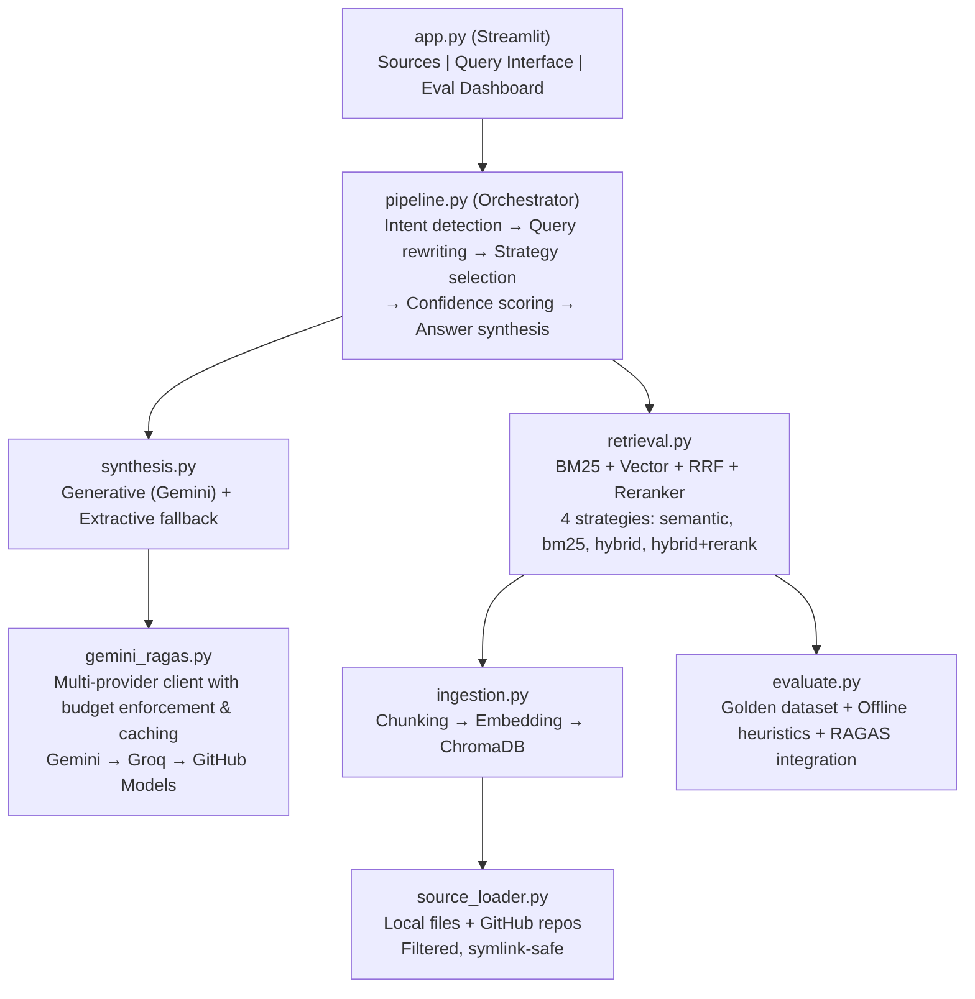
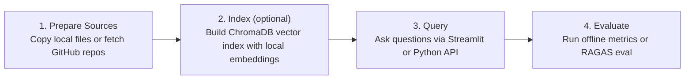

# Advanced-RAG

Retrieval-Augmented Generation system that indexes local codebases and documentation, retrieves context through hybrid search (BM25 + vector embeddings + Reciprocal Rank Fusion), and synthesizes answers using either local extractive methods or free-tier LLM providers. Operates fully offline by default — no paid API keys required.

## Motivation

Most RAG implementations depend on paid APIs (OpenAI, Anthropic) for embeddings, retrieval, and synthesis. This creates a barrier for experimentation and raises concerns about sending proprietary code to third-party services. Advanced-RAG solves this by:

- Running entirely on local infrastructure with open-source models
- Providing a multi-provider fallback chain (Gemini, Groq, GitHub Models) when cloud access is desired
- Evaluating retrieval quality with both offline heuristics and real RAGAS metrics
- Making every external operation explicitly opt-in through environment variables

## Architecture



## How It Works

### 1. Source Ingestion
Local directories or public GitHub repositories are prepared into `data/raw/`. Files are filtered by extension (`.py`, `.md`, `.ts`, `.js`, `.json`, `.yaml`, `.toml`, `.txt`, `.rst`), symlinks are rejected, and ignored directories (`node_modules`, `.git`, `__pycache__`) are skipped.

### 2. Indexing
Source files are chunked (512 tokens, 50-token overlap) using LlamaIndex's `SentenceSplitter`, embedded locally with `BAAI/bge-small-en-v1.5` (HuggingFace), and stored in ChromaDB. Index building is enabled by default; set `ALLOW_INDEX_BUILD=0` to disable it.

### 3. Retrieval
Queries pass through intent detection (stack, overview, architecture, setup, security, evaluation) and term expansion. Four retrieval strategies are available:

| Strategy | Description |
|----------|-------------|
| `semantic_only` | Vector similarity search |
| `bm25_only` | BM25Okapi lexical matching |
| `hybrid_no_rerank` | Vector + BM25 with Reciprocal Rank Fusion |
| `hybrid_rerank` | Hybrid + cross-encoder reranking (`ms-marco-MiniLM-L-6-v2`) |

When no vector index exists, the system falls back to a lexical-only retriever — zero setup required.

### 4. Answer Synthesis
- **Extractive** (default): Selects sentences with strongest lexical overlap to the query. Always available, no API calls.
- **Generative**: Sends retrieved contexts to a free-tier LLM with a structured prompt. Falls back to extractive on failure.

### 5. Evaluation
Generates a golden dataset from indexed content, evaluates all 4 strategies using offline heuristic metrics (faithfulness, answer relevancy, context recall, context precision), and optionally runs real RAGAS evaluation with a cloud provider.

## Usage Flow



### Quick Start

```bash
# Clone and install
git clone https://github.com/Shizu0n/Advanced-RAG && cd Advanced-RAG
pip install -r requirements.txt

# Configure (optional — works offline without any keys)
cp .env.example .env

# Run the Streamlit UI
streamlit run app.py
```

The app opens at `http://localhost:8501` with three tabs:
- **Sources**: Prepare local directories or GitHub repos for indexing
- **Query**: Chat interface with strategy selector and retrieval trace debug
- **Evaluation**: Metrics dashboard with per-question scores and strategy comparison

### Python API

```python
from pipeline import answer_query, chat_query

# Single question
result = answer_query("What authentication method does this project use?")
print(result["answer"])

# Conversational (with history)
result = chat_query("Explain the referral system", history=[
    {"role": "user", "content": "What tech stack is used?"},
    {"role": "assistant", "content": "NestJS backend, React frontend..."}
])
```

### Running Evaluations

```bash
# Offline evaluation (no API keys needed)
python evaluate.py

# With Gemini RAGAS evaluation
USE_GEMINI_FREE_RAGAS=1 ALLOW_CLOUD_FREE_TIER=1 python evaluate.py
```

Outputs:
- `data/eval/ragas_results.csv` — per-strategy summary metrics
- `data/eval/ragas_per_question.csv` — per-question breakdown
- `data/eval/golden_dataset.json` — generated evaluation dataset

## Manual retrieval and evaluation commands

These commands are intentionally explicit. Network fetches, model downloads, and cloud evaluation require opt-in environment variables; index build and cloud chat are enabled by default and can be disabled with explicit opt-out variables.

### 1. Prepare a HuggingFace source

```bash
ALLOW_HF_FETCH=1 python - <<'PY'
from source_loader import prepare_sources
prepare_sources(["hf:Shizu0n/phi3-mini-sql-generator"], allow_huggingface_fetch=True)
PY
```

### 2. Build the local index

```bash
python - <<'PY'
from ingestion import build_index
build_index()
PY
```

Set `ALLOW_INDEX_BUILD=0` to disable index building in app/API flows.

### 3. Ask the portfolio fine-tune question offline

```bash
python - <<'PY'
from pipeline import chat_query
result = chat_query("qual a dataset usada no fine tunning desse model do hugging face?", strategy="hybrid_rerank")
print(result["answer"])
print(result["trace"].get("synthesis", {}))
PY
```

### 4. Run source-scoped evaluation

Offline heuristic evaluation:

```bash
python evaluate.py
```

Cloud RAGAS evaluation requires explicit gates and provider keys:

```bash
ALLOW_CLOUD_FREE_TIER=1 USE_GEMINI_FREE_RAGAS=1 python evaluate.py
```

Cloud chat in the Streamlit query tab is enabled by default when a free-tier provider key is configured. To force extractive fallback:

```bash
ALLOW_CLOUD_CHAT=0 streamlit run app.py
```

## Evaluation Metrics

The system evaluates 4 retrieval strategies across 4 dimensions:

| Metric | What It Measures |
|--------|-----------------|
| **Faithfulness** | Does the answer stay grounded in retrieved context? |
| **Answer Relevancy** | Does the answer address the actual question? |
| **Context Recall** | Does the retrieval capture the relevant information? |
| **Context Precision** | Is the retrieved context focused and not noisy? |

Offline heuristics use term-overlap scoring. RAGAS evaluation uses Gemini as the judge model with locally computed embeddings — no OpenAI dependency.

## Design Principles

**Explicit control for external operations.** Network fetches, model downloads, and cloud evaluation require opt-in environment variables. Query-time cloud chat is enabled when a free-tier provider key is configured and can be forced off with `ALLOW_CLOUD_CHAT=0`.

**Offline-first with graceful degradation.** Generative → extractive fallback. Cloud RAGAS → offline heuristics. Vector index → lexical-only retrieval. The system always works.

**No paid SDKs.** The codebase does not import OpenAI, Anthropic, or their LangChain wrappers. Enforced by test assertions.

**Provider fallback chain.** When cloud chat is enabled and provider keys are configured, requests flow through Gemini → Groq → GitHub Models, with automatic retry on 429/403/5xx and a shared call budget.

## Tech Stack

| Component | Technology |
|-----------|-----------|
| RAG Framework | LlamaIndex 0.11.23 |
| Vector Store | ChromaDB 0.5.15 |
| Local Embeddings | BAAI/bge-small-en-v1.5 (sentence-transformers) |
| Lexical Retrieval | rank-bm25 (BM25Okapi) |
| Reranking | cross-encoder/ms-marco-MiniLM-L-6-v2 |
| Evaluation | RAGAS 0.2.5 + custom offline heuristics |
| UI | Streamlit 1.39.0 |
| Language | Python 3.11 |

## Configuration

All configuration via environment variables. Copy `.env.example` to `.env`.

| Variable | Purpose | Default |
|----------|---------|---------|
| `GEMINI_API_KEY` | Gemini API key (primary provider) | — |
| `GEMINI_MODEL` | Gemini model | `gemini-2.5-flash` |
| `GROQ_API_KEY` / `GROQ_MODEL` | Groq fallback | `llama-3.3-70b-versatile` |
| `GITHUB_MODELS_TOKEN` / `GITHUB_MODELS_MODEL` | GitHub Models fallback | — |
| `ALLOW_INDEX_BUILD` | Permit ChromaDB index building (`0` disables) | `1` |
| `ALLOW_MODEL_DOWNLOADS` | Permit cross-encoder download | `0` |
| `ALLOW_GITHUB_FETCH` | Permit GitHub repo download | `0` |
| `ALLOW_CLOUD_FREE_TIER` | Permit cloud evaluation | `0` |
| `USE_GEMINI_FREE_RAGAS` | Enable RAGAS with Gemini | `0` |
| `ALLOW_CLOUD_CHAT` | Permit query-time cloud chat (`0` forces extractive fallback) | `1` |
| `MAX_CLOUD_CHAT_CALLS` | Query-time cloud chat budget cap | `1` |
| `MAX_GEMINI_CALLS` | Evaluation API call budget cap | `120` |

## Running Tests

```bash
# All tests
python -m unittest discover -s tests -v

# Single file
python -m unittest tests.test_pipeline -v

# Single method
python -m unittest tests.test_pipeline.PipelineTests.test_chat_query_stack_aggregates_technologies_with_evidence -v
```

Tests use `unittest` with extensive mocking. Validates that paid SDKs are never imported, network calls are blocked by default, and all fallback paths work correctly.
